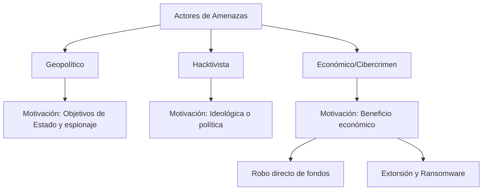
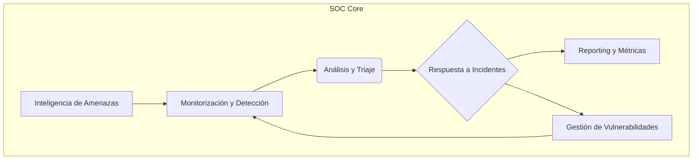
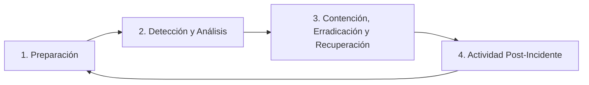

# Guía de Estudio de Ciberseguridad y Respuesta a Incidentes

## Introducción

Esta guía consolida y estructura conceptos fundamentales sobre ciberseguridad, respuesta a incidentes (IR) y análisis forense digital del curso de Respuesta a Incidentes de Tecno Campus de la Universidad Pompeu Fabra Cohorte Noviembre 2025. El objetivo es servir como un apunte formal y ordenado para profesionales, estudiantes y entusiastas que deseen profundizar sus conocimientos. Intentarécubrir desde el panorama de amenazas y los modelos organizativos de defensa, hasta el ciclo de vida de la respuesta a incidentes, las técnicas forenses y las herramientas clave del sector, culminando con un caso práctico que integra los conceptos aprendidos.

## Parte I: Fundamentos de Ciberseguridad

### 1. El Panorama de Amenazas (Threat Landscape)

Comprender el entorno de amenazas es el primer paso para una defensa efectiva.

#### Vectores de Ataque Principales
- **Sustracción de Credenciales:** Es el vector más común (citado como el 71% de los ataques). Métodos incluyen:
  - **Phishing/Vishing/Smishing:** A través de correos, llamadas y SMS.
  - **Ingeniería Social:** En redes sociales y aplicaciones.
  - **Malware:** Keyloggers, stealers, etc.

#### Actores de Amenazas y sus Motivaciones

#### Amenazas Derivadas
El compromiso de credenciales es a menudo solo el punto de partida para ataques más graves:
- Despliegue de **Ransomware**.
- **Venta de credenciales** en mercados clandestinos.
- **Acceso ilegítimo** a la infraestructura.
- **Fraude** y suplantación de identidad.
- **Exfiltración** de información sensible.
- **Espionaje**.

### 2. Modelos Organizativos de Defensa

#### El SOC (Security Operations Center)
Un SOC es una unidad centralizada que gestiona la seguridad de forma continua.

**Funciones Clave de un SOC:**

#### Equipos de Respuesta: CERT vs. CSIRT
- **CERT (Computer Emergency Response Team):** Término originalmente asociado con el CERT/CC de Carnegie Mellon. Hoy se usa de forma más genérica.
- **CSIRT (Computer Security Incident Response Team):** El término más común para un equipo que gestiona incidentes de seguridad.

#### Modelo de Madurez y Estructura Jerárquica (Tiers)
Un SOC maduro opera con una estructura de niveles para una gestión eficiente de alertas:
- **Tier 1:** Triaje inicial, gestión de alertas de baja severidad y descarte de falsos positivos.
- **Tier 2:** Análisis profundo de incidentes, determinación del alcance y contención inicial.
- **Tier 3:** Expertos en Threat Hunting, análisis forense y de malware para investigaciones complejas.
- **SOC Manager:** Liderazgo, estrategia y gestión de crisis.

## Parte II: El Ciclo de Vida de la Respuesta a Incidentes (IR)

### 1. Frameworks y Metodologías

#### NIST Incident Response Lifecycle (SP 800-61)
Es el estándar de facto para la gestión de incidentes.

#### Otros Modelos Relevantes
- **Cyber Kill Chain (Lockheed Martin):** Modela las 7 fases de un ciberataque desde la perspectiva del adversario.
- **MITRE ATT&CK®:** Una base de conocimiento global de tácticas y técnicas de adversarios, esencial para el Threat Hunting y la mejora de detecciones.
- **Diamond Model of Intrusion Analysis:** Modela un incidente con cuatro vértices: Adversario, Infraestructura, Capacidad y Víctima.

### 2. Fases Detalladas de la Respuesta (NIST)

1.  **Preparación:** Fase proactiva. Tener las herramientas (EDR, SIEM), personal capacitado y procesos (Playbooks) listos.
2.  **Detección y Análisis:**
    - **Identificación:** Una alerta (EDR, firewall, SIEM) o un reporte de usuario inicia el proceso.
    - **Análisis:** Recolectar datos (logs, tráfico de red, artefactos de endpoint) para validar la alerta y entender qué ocurre.
    - **Priorización:** Clasificar el incidente según su impacto potencial y urgencia.
3.  **Contención, Erradicación y Recuperación:**
    - **Contención:** Aislar los sistemas afectados para evitar la propagación.
    - **Erracicación:** Eliminar la causa raíz (malware, vulnerabilidad, cuenta comprometida).
    - **Recuperación:** Restaurar los sistemas a un estado operativo seguro, a menudo desde backups limpios.
4.  **Actividad Post-Incidente (Lessons Learned):**
    - Crear un informe final detallado.
    - Analizar qué funcionó y qué no para mejorar la postura de seguridad y los procesos de respuesta futuros.

## Parte III: Fundamentos de Forense Digital y Colección de Evidencia

### 1. Principios Clave

#### Orden de Volatilidad
Recolectar la evidencia desde lo más volátil a lo menos volátil para evitar su pérdida:
1.  **Registros de CPU, caché, ARP.**
2.  **Memoria del Sistema (RAM).**
3.  **Archivos temporales y estado de la red.**
4.  **Datos en disco duro.**
5.  **Logs remotos.**
6.  **Backups.**

#### Forense en Vivo vs. Post-Mortem

| Característica        | Forense en Vivo (Live Forensics)             | Forense Post-Mortem (Dead Forensics)          |
| --------------------- | -------------------------------------------- | --------------------------------------------- |
| **Estado del Sistema**| Encendido (en ejecución)                     | Apagado                                       |
| **Ventaja Principal** | Permite adquirir RAM y sortear cifrado de disco. | Método forensemente más sólido, no altera el disco. |
| **Desventaja Principal**| La adquisición modifica el estado del sistema. | No se puede adquirir la memoria RAM.          |

### 2. Cadena de Custodia
Es el proceso que garantiza la **integridad** de la evidencia.
- **Documentación:** Registrar cada paso: quién, qué, cuándo, dónde y por qué.
- **Hashing:** Calcular un hash (ej. SHA-256) de la evidencia original y de cada copia para verificar que no ha sido alterada.
- **Trabajar sobre copias:** Nunca analizar la evidencia original.

### 3. Artefactos Digitales Clave (Windows)
- **Sistema de Archivos:** `MFT` (Master File Table) en NTFS.
- **Registro de Windows:** Claves de persistencia como `Run` y `RunOnce`.
- **Artefactos de Ejecución:**
  - **Prefetch:** Registra la ejecución de aplicaciones.
  - **Shimcache (AppCompatCache):** Evidencia de ejecutables, incluso si fueron eliminados.
  - **Windows Timeline:** Base de datos (`ActivitiesCache.db`) con la actividad reciente del usuario.

## Parte IV: Clasificación de Herramientas Mencionadas

Esta sección clasifica las herramientas y tecnologías mencionadas en el material de estudio.

### 1. Plataformas de Visibilidad y Gestión
- **SIEM (Security Information and Event Management):**
  - `Splunk`: Plataforma para búsqueda, monitorización y análisis de datos de máquina.
  - `QRadar`: Solución SIEM de IBM.
- **Seguridad de Endpoints (EDR/XDR):**
  - `SentinelOne`, `CrowdStrike`, `Sophos`, `Microsoft Defender`: Soluciones comerciales de EDR.
  - `Wazuh`: Solución EDR de código abierto.
- **Seguridad de Red (NDR):**
  - `Darktrace`, `Netscope`: Herramientas que usan IA para analizar el tráfico de red y detectar anomalías.
- **SOAR (Security Orchestration, Automation, and Response):**
  - Plataformas que integran herramientas y automatizan flujos de trabajo de respuesta.

### 2. Análisis Forense y Respuesta a Incidentes
- **Suites de Adquisición y Análisis (Triage):**
  - `KAPE (Kroll Artifact Parser and Extractor)`: Para recolección rápida de artefactos forenses.
  - `Cyber Triage`: Para analizar la evidencia recolectada por KAPE.
  - `Velociraptor`: Herramienta avanzada para recolección y análisis de endpoints a escala.
  - `UAC (Unix-like Artifacts Collector)`: Herramienta para recolección de artefactos en sistemas Linux.
- **Creación de Imágenes Forenses:**
  - `FTK Imager`: Herramienta estándar para crear imágenes forenses (copias bit a bit).
  - `Arsenal Image Mounter`: Monta imágenes forenses como discos locales.
  - `dd`, `ewfacquire`: Comandos de Linux para la creación de imágenes.
- **Análisis de Memoria:**
  - `WinPmem`: Para adquirir volcados de memoria RAM en sistemas Windows.
- **Plataformas de Gestión de Casos:**
  - `DFIR-IRIS`: Plataforma de código abierto para la gestión colaborativa de casos de IR.
  - `Scribe`: Herramienta para la creación automática de documentación y guías paso a paso.

### 3. Análisis de Malware y Amenazas
- **Sandboxing (Entornos de Ejecución Aislados):**
  - `Any.run`, `Joe Sandbox`, `CAPEv2`: Servicios para ejecutar archivos sospechosos en un entorno controlado y observar su comportamiento.
- **Plataformas de Análisis de Ficheros y Reputación:**
  - `VirusTotal`, `Malwarebazar`: Analizan archivos y URLs con múltiples motores de antivirus y herramientas.
  - `unpacme`, `intezer`: Plataformas especializadas en desempacar y analizar código de malware.
- **Motores de Reglas:**
  - `YARA`: Crea reglas para identificar y clasificar malware basado en patrones.

### 4. Inteligencia de Amenazas y OSINT
- **Plataformas de Threat Intelligence (TIP):**
  - `AlienVault OTX`, `MISP`: Comunidades y plataformas para compartir indicadores de compromiso (IOCs).
- **Repositorios y Buscadores de Indicadores:**
  - `AbuseIPDB`: Reputación de direcciones IP.
  - `Phishtank`, `urlscan.io`: Reputación de URLs y análisis de sitios web.
  - `Shodan`, `Censys`: Motores de búsqueda para dispositivos conectados a Internet.
  - `Talos Intelligence`: Centro de inteligencia de amenazas de Cisco.

### 5. Herramientas de Red y Sistema
- **Análisis de Red:**
  - `Wireshark`: Analizador de protocolos de red.
  - `Nmap`, `Zenmap`: Escáner de puertos y servicios de red.
- **Utilidades de Sistema:**
  - `ipconfig`, `procmon`, `wmic`: Comandos y herramientas de Windows para obtener información del sistema y de red.
- **Utilidades de Análisis General:**
  - `CyberChef`: "La navaja suiza" para decodificar, desofuscar y analizar datos.
  - `Microsoft Message Analyzer`: Herramienta para capturar, visualizar y analizar tráfico y logs.

## Parte V: Caso Práctico - De la Alerta a la Resolución

Este caso práctico sintetiza un incidente complejo, mostrando la aplicación de los conceptos en un escenario realista.

1.  **Detección:** Alerta de EDR a las 17:45 por tráfico DNS anómalo y masivo desde el PC de un desarrollador (`jlopez`).
2.  **Análisis:**
    - El alcance se expande al Call Center (sin EDR) y a una DMZ de BBDD.
    - Se confirma exfiltración de datos vía DNS tunneling.
    - Se descubre que el atacante usa la cuenta de `jlopez` desde la red TOR, confirmando un robo de credenciales.
    - El análisis de un volcado de memoria del Controlador de Dominio (DC) revela el uso de `chisel` (un backdoor).
3.  **Contención:**
    - **18:50:** Se bloquea el dominio malicioso, se deshabilita la cuenta de `jlopez` y se cierran sus sesiones VPN.
    - **19:03:** Se corta el acceso a internet de la DMZ de BBDD al detectar un segundo dominio malicioso.
4.  **Erradicación:**
    - Se descubre que el atacante se movió lateralmente vía RDP desde el PC del desarrollador al DC.
    - **Causa Raíz:** El atacante creó un **Golden Ticket** tras comprometer la cuenta `krbtgt` del dominio, obteniendo control total y persistente.
    - **Acciones:** Se resetea la contraseña de `krbtgt` dos veces para invalidar el ticket y se cambian las credenciales de todos los usuarios.
5.  **Post-Incidente (Lecciones Aprendidas):**
    - **Visibilidad:** La falta de EDR en segmentos clave de la red fue crítica.
    - **Segmentación:** Una red plana facilitó el movimiento lateral del atacante.
    - **Gestión de Privilegios:** Se requiere una revisión de los permisos y de la seguridad del Active Directory.
    - **Proactividad:** El análisis rápido y la identificación del Golden Ticket evitaron un ataque de ransomware inminente, cuyo ejecutable fue encontrado en el DC.
  
### Pendiente Agregar:
- Plantilla de recoleccion de evidencias
- Plantilla de cadena de custodia
- Mapa de herramientas segun funciones
- Paso a paso de armado de laboratorios con comandos paso a paso en linux y Windows
- Armado de laboratorio en docker con herramientas opensource de práctica (quizas en una vps para compartir con el team)
